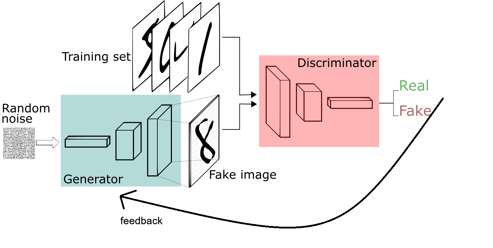
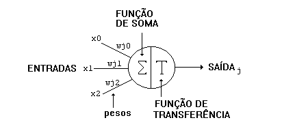
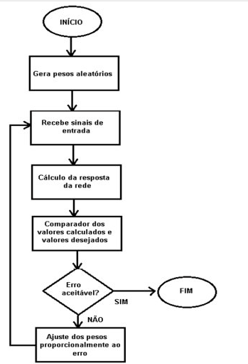

# Estudo sobre Ia
        Meu estudo sobre IA. Assuntos básicos 

## Básico de IA para Devs

### Tipos de rede

percepriton shadon 

Rede adversárias
    Dois algoritmos de rede neural, um contra o outro em busca do mesmo benefício. De forma resumida, imagina que temos um dataset com fotos de tigres, uma IA especializada em identificar tigres vai avaliar a gerão de desenhos/imagens de tigres de outra IA. Essa segunda IA vai melhorar conforme o feedback da primeira. 
    

Transformers
    Empilhamento de redes. Como se fossem blocos de legos encaixados. Camadas sobre camadas, são bem pesadas. Os modelos transformer aplicam um conjunto em evolução de técnicas matemáticas, chamadas de atenção ou autoatenção, para detectar as maneiras sutis como até mesmo elementos de dados distantes em uma série influenciam e dependem uns dos outros.

### Treinamento
DATASET - para o treinamento preciso ter um dataset específico no tema e diversificado na variação desse tema. Por exemplo, DATASET cachorro tem fotos de cachorro de todas as raças, assim evita treinar o modelo para identificar apenas uma raça.

Entre cada par de neorônio, da rede neural, terá um peso. Esse peso vai ditar para a rede neural como interpretar o valor de entrada e dessa forma influenciar a resposta na saída.

Pode ser exportado, logo um treinamento de uma IA pode ser exportado ao se obter os pesos de cada nó. 

Para definir o peso usamos uma lógica como:

<!--  -->